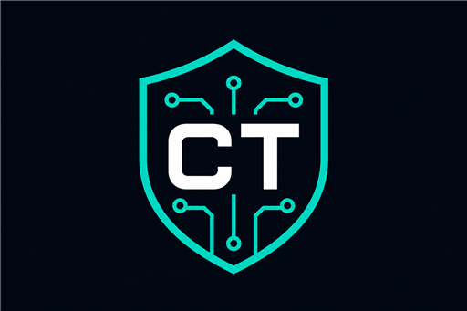

<p align="center">
  
</p>

<h1 align="center">CyberTool</h1>

<p align="center">
  <strong>Open-source Windows cybersecurity and IT diagnostics for authorized environments.</strong>
</p>

<p align="center">
  <a href="https://github.com/TahaAkgl27/CyberTool/actions/workflows/build.yml"></a>
  <a href="LICENSE"></a>
  <a href="https://dotnet.microsoft.com/"></a>
  <a href="https://www.microsoft.com/windows"></a>
  <a href="SECURITY.md"></a>
</p>

<p align="center">
  <a href="#features">Features</a> ·
  <a href="#screenshots">Screenshots</a> ·
  <a href="#architecture">Architecture</a> ·
  <a href="#getting-started">Getting Started</a> ·
  <a href="#roadmap">Roadmap</a> ·
  <a href="#contributing">Contributing</a> ·
  <a href="#faq">FAQ</a>
</p>

---

## Overview

**CyberTool** is a local-first Windows desktop application built with **WinUI 3** and **.NET 8**. It brings together network discovery, Windows system enumeration, security assessment helpers, optional AI-assisted analysis, and training-oriented simulations in one transparent toolkit.

Organizations and learners often juggle separate scripts, scanners, and ad-hoc PowerShell for basic Windows diagnostics. CyberTool reduces that fragmentation by offering a structured workflow—from port scan to device profile to exportable reports—while keeping data on the local machine.

> **Authorized use only.** CyberTool includes security testing and simulation capabilities. Read [DISCLAIMER.md](DISCLAIMER.md) before use.

| | |
|---|---|
| **Problem** | Fragmented Windows security diagnostics across multiple tools and scripts |
| **Solution** | Unified, inspectable, local-first diagnostics and training platform |
| **Model** | Open source (MIT), community-driven, safety-documented |

---

## Who Should Use CyberTool

<table>
<tr>
<td width="50%">

**Operations & Security**
- Windows Administrators
- IT Engineers
- Helpdesk Teams
- SOC Teams
- Blue Teams

</td>
<td width="50%">

**Education & Research**
- Cybersecurity Students
- Training Labs
- Educational Institutions
- Authorized Red Team exercises
- Security awareness programs

</td>
</tr>
</table>

CyberTool is **not** intended for unauthorized testing, covert operations, or use against systems without explicit permission.

---

## Features

### System Diagnostics

| Capability | Description |
|------------|-------------|
| Device profiling | Host metadata, OS context, and extended protocol hints |
| WMI enumeration | Remote Windows metadata via authenticated queries |
| Hardening insights | Registry and configuration checks for local posture |
| Executive summaries | Risk scoring and stakeholder-ready narratives |

### Network Discovery

| Capability | Description |
|------------|-------------|
| Port scanning | Configurable TCP port range analysis |
| Service identification | Protocol and service mapping per open port |
| Exposure analysis | Internal vs. internet-facing scope classification |
| Attack surface summary | Aggregated external and risky service counts |

### Security Assessment

| Capability | Description |
|------------|-------------|
| Risk scoring | Severity tiers with rationale per finding |
| Compliance hints | Framework-oriented violation mapping |
| Remediation suggestions | Template and AI-assisted fix scripts with rollback |
| Attack graph simulation | Chain-style path modeling for defense planning |

### Windows Enumeration

| Capability | Description |
|------------|-------------|
| WMI deep scan | Authenticated enumeration of remote hosts |
| SMB context | Signing status and related protocol signals |
| System inventory | OS, CPU, RAM, domain/workgroup heuristics |
| Nmap XML import | Ingest external scan results |

### AI Assisted Analysis

| Capability | Description |
|------------|-------------|
| Scan explanation | Optional OpenAI-powered attack scenario narratives |
| Remediation generation | Context-aware PowerShell packages (user-reviewed) |
| Token-efficient prompts | Minified input to reduce API cost |
| Fully optional | Core features work without any API key |

### Incident Investigation

| Capability | Description |
|------------|-------------|
| Session history | Local persistence of scan sessions |
| Trend tracking | Days-open style port exposure metrics |
| Technical reports | Detailed port and vulnerability notes |
| Executive reports | Business-impact oriented summaries |

### Training & Education

| Capability | Description |
|------------|-------------|
| Lab demo data | Generic sample hosts for classroom scenarios |
| Ransomware simulation | Subnet awareness training (authorized labs) |
| Attack module helpers | Authorized credential assessment workflows |
| Safety documentation | [docs/safety.md](docs/safety.md) and [DISCLAIMER.md](DISCLAIMER.md) |

---

## Screenshots

<p align="center">
  
</p>

<p align="center">
CyberTool v1.0.0 running on Windows. Demonstrates port scanning, attack chain visualization, security recommendations and host analysis in a controlled demo environment.
</p>

---

## Architecture

CyberTool follows **MVVM** with a service-oriented backend:

```
Views (WinUI 3)  →  ViewModels  →  Services  →  Models / Local Storage
```

- **Views:** `DashboardPage`, `ScanPage`, `DeviceProfilePage`, `AttackPage`, `RansomwarePage`, `ReportsPage`, `SettingsPage`
- **Services:** Scan orchestration, WMI, OpenAI, remediation, reporting, history
- **Storage:** `%AppData%\CyberTool\` (config, history), `%LocalAppData%\CyberTool\` (logs, scan history)

Full diagrams: [docs/architecture.md](docs/architecture.md)

---

## Getting Started

### Requirements

- Windows 10 (1809+) or Windows 11
- [.NET SDK 8.0](https://dotnet.microsoft.com/download/dotnet/8.0)
- Windows App SDK (via NuGet restore)
- x64 recommended

### Build from Source

```powershell
git clone https://github.com/TahaAkgl27/CyberTool.git
cd CyberTool
dotnet restore CyberTool.csproj
dotnet build CyberTool.csproj -c Release -p:Platform=x64
```

Run with Visual Studio (**CyberTool (Unpackaged)**) or:

```powershell
.\bin\x64\Release\net8.0-windows10.0.19041.0\CyberTool.exe
```

### Configure OpenAI (Optional)

1. Open **Settings**
2. Enter your API key (`sk-...`)
3. Click **Save**

Key stored locally at `%AppData%\CyberTool\config.json` — never in source control.

Detailed guide: [docs/usage.md](docs/usage.md)

---

## Roadmap

| Version | Focus |
|---------|-------|
| **v1.0** | Public release, safety docs, CI |
| **v1.1** | DPAPI / Credential Manager for API keys |
| **v1.2** | Reporting export, Plugin SDK foundation |
| **v1.5** | Localization, dark theme improvements |
| **v2.0** | Enterprise Safe Mode, plugin marketplace, offline AI |

Full roadmap: [docs/roadmap.md](docs/roadmap.md)

---

## Contributing

We welcome contributions that improve safety, documentation, and diagnostics quality.

- [CONTRIBUTING.md](CONTRIBUTING.md) — setup and PR checklist
- [CODE_OF_CONDUCT.md](CODE_OF_CONDUCT.md) — community standards
- [docs/FIRST_ISSUES.md](docs/FIRST_ISSUES.md) — starter issue ideas
- [SECURITY.md](SECURITY.md) — report via GitHub Security Advisories

```powershell
dotnet build CyberTool.csproj -c Release -p:Platform=x64
```

---

## FAQ

<details>
<summary><strong>Is CyberTool malware?</strong></summary>

No. CyberTool is a legitimate diagnostics and training application. It is not designed for covert deployment, unauthorized access, or data theft. See [DISCLAIMER.md](DISCLAIMER.md).
</details>

<details>
<summary><strong>Can I use CyberTool on any IP address?</strong></summary>

Only on systems you own or have **written authorization** to assess. Unauthorized scanning may violate law and policy.
</details>

<details>
<summary><strong>Does CyberTool send data to the cloud?</strong></summary>

Core scanning and history are local-only. If you configure an OpenAI API key, selected scan summaries are sent to OpenAI per your account terms.
</details>

<details>
<summary><strong>Do I need an OpenAI API key?</strong></summary>

No. Scanning, enumeration, reporting, and simulation work without AI. The key enables optional explanations and dynamic remediation suggestions.
</details>

<details>
<summary><strong>What license is CyberTool under?</strong></summary>

[MIT License](LICENSE) — Copyright (c) 2026 CyberTool Contributors.
</details>

<details>
<summary><strong>How do I report a security vulnerability?</strong></summary>

Use [GitHub Security Advisories](https://github.com/TahaAkgl27/CyberTool/security/advisories/new). Do not file public issues for undisclosed vulnerabilities.
</details>

---

## Security & Disclaimer

| Document | Purpose |
|----------|---------|
| [SECURITY.md](SECURITY.md) | Vulnerability reporting and secure development |
| [DISCLAIMER.md](DISCLAIMER.md) | Authorized-use legal notice |
| [docs/safety.md](docs/safety.md) | Operational safety guide |

---

## Support

- **Documentation:** [docs/](docs/)
- **Bug reports:** [Issue template](.github/ISSUE_TEMPLATE/bug_report.md)
- **Security:** GitHub Security Advisories only

---

## Future Vision

CyberTool aims to become a trusted, community-maintained Windows security diagnostics platform—transparent in code, conservative in data handling, and explicit about authorized use. Long-term goals include enterprise-safe offline operation, extensible plugin architecture, and accessible security education worldwide.

Learn more: [docs/claude-for-open-source.md](docs/claude-for-open-source.md)

---

<p align="center">
  <sub>Built with WinUI 3 · .NET 8 · Windows App SDK</sub><br/>
  <sub>Copyright (c) 2026 CyberTool Contributors · <a href="LICENSE">MIT License</a></sub>
</p>
