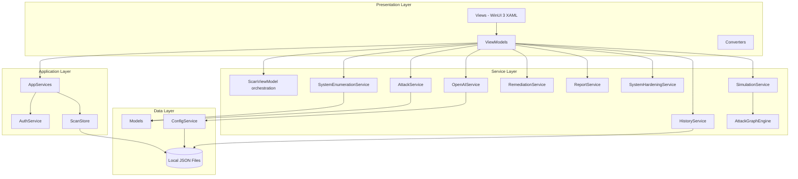
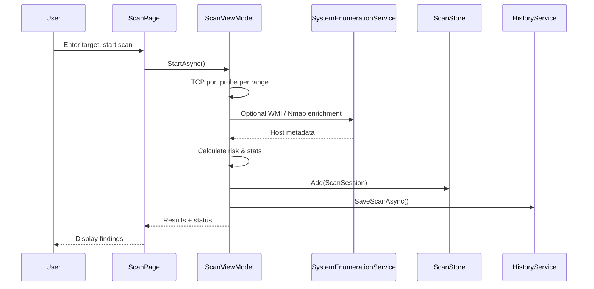
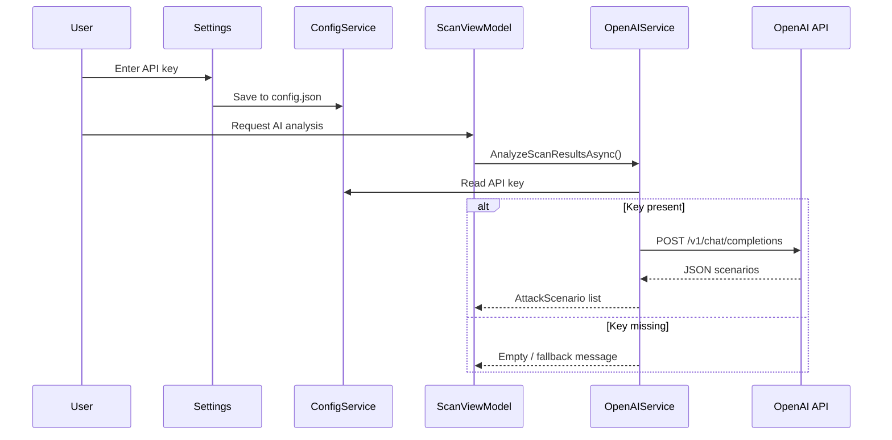
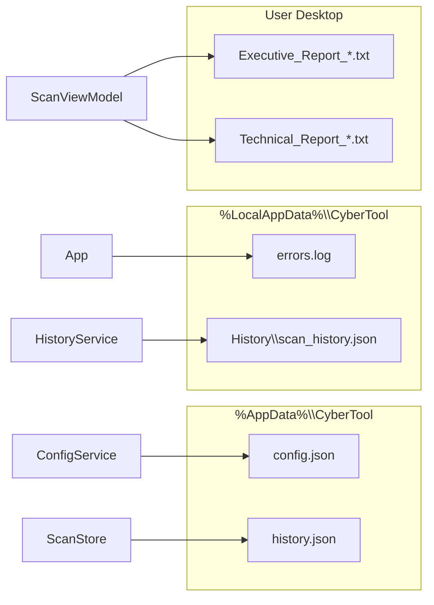
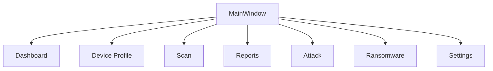
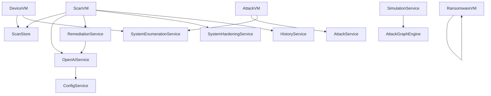
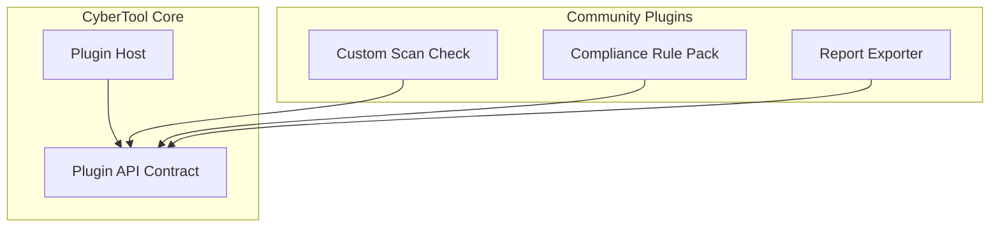

# CyberTool Architecture

This document describes the technical architecture of CyberTool as implemented today, and outlines planned extensibility.

## Design Principles

| Principle | Implementation |
|-----------|----------------|
| Local-first | Scan data and history stored on the user's machine |
| MVVM separation | Views bind to ViewModels; business logic in Services |
| Optional AI | OpenAI integration is user-configured and non-blocking |
| Authorized scope | Offensive modules documented and training-oriented |
| Inspectability | Open source codebase for audit and education |

---

## Layer Overview



---

## MVVM Structure

### Views (`Views/`)

WinUI 3 `Page` and `Window` components. Data context is set in XAML or code-behind. Navigation is handled by `MainWindow` via `NavigationView` tags.

| View | Purpose |
|------|---------|
| `DashboardPage` | Landing, safety messaging, quick orientation |
| `ScanPage` | Port scan, results, AI analysis, remediation |
| `DeviceProfilePage` | Host profile and enumeration display |
| `AttackPage` | Authorized attack helper workflows |
| `RansomwarePage` | Subnet simulation for training |
| `ReportsPage` | Session and report management |
| `SettingsPage` | OpenAI API key configuration |
| `LoginWindow` | Optional authentication UI |

### ViewModels (`ViewModels/`)

Inherit from `ObservableObject`. Expose properties and `RelayCommand` / `AsyncRelayCommand` for UI binding.

| ViewModel | Responsibility |
|-----------|----------------|
| `ScanViewModel` | Scan lifecycle, risk stats, AI, remediation, reports |
| `DeviceViewModel` | Device profile rendering, deep scan, roadmap |
| `AttackViewModel` | Attack module UI state and logging |
| `RansomwareViewModel` | Subnet scan simulation |
| `ReportsViewModel` | Report listing |
| `ViewModelBase` | Shared base |

### Models (`Models/`)

Plain data objects serialized to JSON where needed.

| Model | Purpose |
|-------|---------|
| `ScanSession` | Target, timestamps, findings, enumeration metadata |
| `PortFinding` | Port, service, risk, recommendations |
| `DeviceProfile` | Host inventory presentation model |
| `AttackScenario` | AI-generated scenario structure |
| `HardeningSuggestion` | Remediation package with scripts |
| `AttackGraph` | Graph nodes for simulation |

### Core (`Core/`)

| Type | Purpose |
|------|---------|
| `ObservableObject` | `INotifyPropertyChanged` base |
| `RelayCommand` | Synchronous UI commands |
| `AsyncRelayCommand` | Async UI commands |

### Converters (`Converters/`)

XAML value converters for visibility, severity colors, formatting.

---

## Services Layer

| Service | Role |
|---------|------|
| `ScanStore` | ObservableCollection persistence (`history.json`) |
| `HistoryService` | Trend/history for port exposure over time |
| `ConfigService` | OpenAI API key in `%AppData%\CyberTool\config.json` |
| `SystemEnumerationService` | WMI, Nmap XML parsing, authenticated enumeration |
| `AttackService` | SMB credential testing helpers (authorized) |
| `OpenAIService` | Chat Completions API for analysis and scripts |
| `RemediationService` | AI or template-based fix generation |
| `ReportService` | Executive and technical report text |
| `SystemHardeningService` | Local registry/event log posture checks |
| `SimulationService` | Attack scenario packaging |
| `AttackGraphEngine` | Attack path graph construction |
| `NmapXmlImporter` | External scan import |
| `AuthService` | DEBUG-only demo authentication |

### AppServices

Static service locator for shared singletons:

```csharp
public static class AppServices
{
    public static ScanStore ScanStore { get; }
    public static AuthService AuthService { get; }
}
```

---

## Scanning Flow



---

## OpenAI Integration Flow



**Privacy note:** Only user-initiated AI calls transmit data. Content is minimized (port/service summary). See [safety.md](safety.md).

---

## Data Storage



All paths are gitignored. No cloud sync is built in.

---

## Navigation Architecture



---

## Dependency Graph (Simplified)



---

## Future Plugin Architecture (Planned v1.2+)



Planned capabilities:

- `ICyberToolPlugin` interface for scan checks and report hooks
- Sandboxed execution with explicit permission declarations
- Offline rule packs without external API dependency

See [roadmap.md](roadmap.md).

---

## Technology Stack

| Component | Technology |
|-----------|------------|
| UI | WinUI 3, XAML |
| Runtime | .NET 8, Windows App SDK 1.8 |
| WMI | `System.Management` |
| HTTP | `HttpClient` (OpenAI) |
| Serialization | `System.Text.Json` |
| CI | GitHub Actions, `windows-latest` |

---

## Related Documents

- [usage.md](usage.md) — operator guide
- [safety.md](safety.md) — authorized use
- [roadmap.md](roadmap.md) — milestones
- [OPEN_SOURCE_HEALTH.md](OPEN_SOURCE_HEALTH.md) — project health assessment
