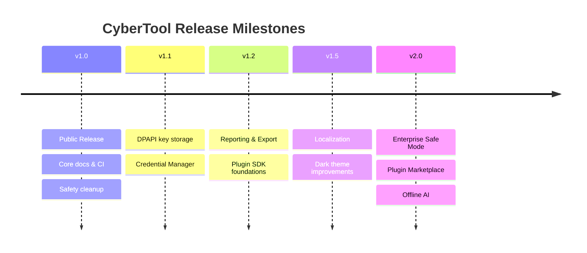

# CyberTool Roadmap

Professional milestone plan for the open source project. Dates are indicative and may shift based on community feedback and maintainer capacity.

---

## Vision

Evolve CyberTool from a capable desktop toolkit into a **trusted, extensible, community-driven** Windows security diagnostics platform—safe for labs, transparent for auditors, and practical for IT teams.

---

## Milestone Overview

---

## v1.0 — Public Release

**Status:** Current milestone  
**Theme:** Trust, transparency, and release readiness

### Delivered

- [x] Remove hardcoded secrets and personal identifiers
- [x] Settings-based OpenAI API key configuration
- [x] MIT license and governance docs (README, SECURITY, CONTRIBUTING, CODE_OF_CONDUCT)
- [x] Safety disclaimer and ethical-use documentation
- [x] GitHub Actions CI (Release x64 build)
- [x] Issue and PR templates
- [x] Architecture and user documentation
- [x] `.gitignore` and build artifact cleanup

### Remaining for v1.0 polish

- [ ] Replace `OWNER` placeholder in GitHub URLs
- [ ] Capture real screenshots ([SCREENSHOT_CHECKLIST.md](images/SCREENSHOT_CHECKLIST.md))
- [ ] Publish `v1.0.0` GitHub Release
- [ ] Optional demo GIF ([GIF_RECORDING_GUIDE.md](GIF_RECORDING_GUIDE.md))

---

## v1.1 — Secure Credential Storage

**Theme:** Protect local secrets at rest

| Item | Description |
|------|-------------|
| DPAPI encryption | Encrypt OpenAI API key using Windows DPAPI |
| Credential Manager | Optional storage in Windows Credential Manager |
| UI indicator | Show key configured status without exposing value |
| Migration | Upgrade path from plain `config.json` |

**Success criteria:** API key not readable in plain text from disk without user context.

---

## v1.2 — Reporting, Export & Plugin SDK

**Theme:** Professional output and extensibility foundations

### Reporting & Export

- [ ] PDF and HTML export for executive/technical reports
- [ ] Configurable output directory
- [ ] Redaction options for sensitive fields
- [ ] Improved Nmap XML import

### Plugin SDK (Foundations)

- [ ] `IScanPlugin` interface and loader contract
- [ ] Sample plugin project in `samples/`
- [ ] Documentation for third-party check authors
- [ ] Signed plugin manifest format (design)

**Success criteria:** Contributors can add a custom scan check without modifying core ViewModels.

---

## v1.5 — Localization & Dark Theme

**Theme:** Broader accessibility and polish

| Item | Description |
|------|-------------|
| Localization | Resource files for UI strings (Turkish + English baseline) |
| Community translations | Contributor guide for i18n |
| Dark theme | Consistent WinUI theming across all pages |
| High contrast | Accessibility pass for SOC/long-session use |

---

## v2.0 — Enterprise Safe Mode

**Theme:** Policy-driven deployment for organizations

| Item | Description |
|------|-------------|
| Enterprise Safe Mode | Restrict targets, disable offensive modules via policy file |
| Plugin Marketplace | Curated community plugin directory (design + governance) |
| Offline AI | Local model integration option (no external API) |
| Group Policy | Deployment-friendly configuration |
| Role-based gating | Feature tiers by role |
| Signed releases | Authenticode-signed binaries + SBOM |

**Success criteria:** Security team can deploy CyberTool with organizational policy without source modifications.

---

## Community Input

Priorities may change based on:

- GitHub Issues and Discussions
- Security researcher feedback
- Contributions from Windows admins and SOC teams
- Educational institution requirements

**Suggest roadmap items:** [feature request template](../.github/ISSUE_TEMPLATE/feature_request.md)

---

## What We Will Not Prioritize

To maintain project integrity:

- Covert or unauthorized access features
- Built-in telemetry or cloud data collection
- Removal of safety documentation for "marketing"
- Features that bypass organizational security controls without explicit policy design

---

## Related Documents

- [FIRST_ISSUES.md](FIRST_ISSUES.md) — Starter contribution ideas
- [architecture.md](architecture.md) — Plugin architecture preview
- [OPEN_SOURCE_HEALTH.md](OPEN_SOURCE_HEALTH.md) — Project health assessment
